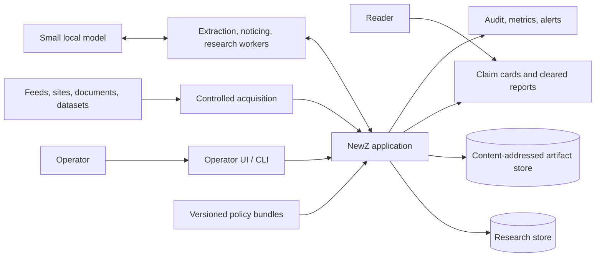
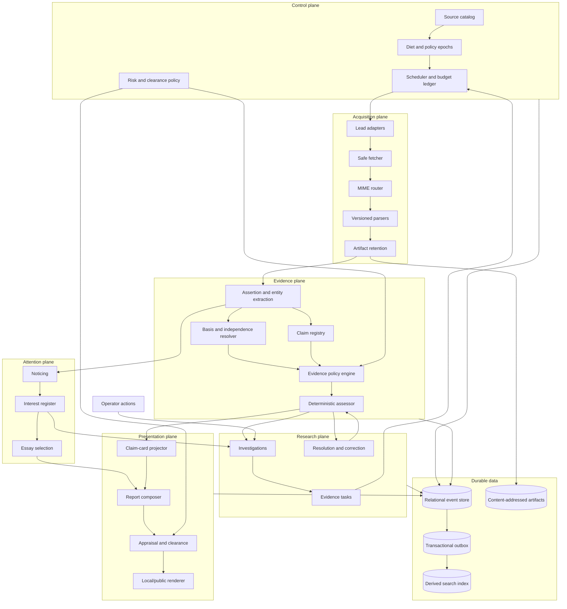
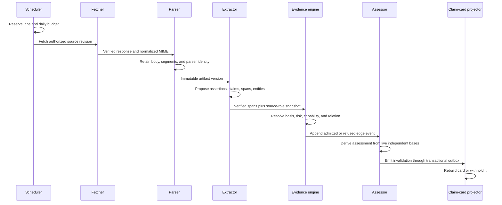
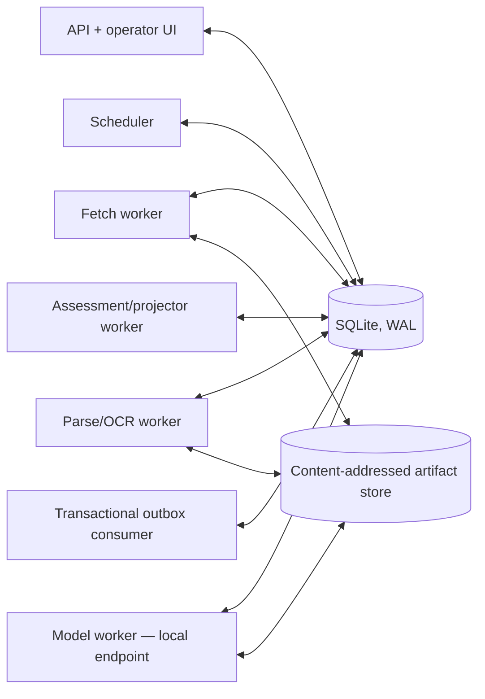

# ARCHITECTURE

**Status:** Authoritative target architecture
**Document version:** 1.7.1
**Effective:** 2026-09-04

NewZ is a modular monolith with asynchronous workers and an append-oriented
research store. One evidence model serves every interface. Acquisition is
untrusted; clearance is approve-by-default and revocable, and reach is
local-first.

## System context



The model is a small, locally served, replaceable tool outside the trust
boundary. It proposes structure and notices what may be worth pursuing;
deterministic policy and persisted evidence decide capability and state. Its
smallness is load-bearing — see `SPEC.md` section 2.3 and ADR-0002.

## Component architecture



## Evidence flow



No arrow skips from a lead, snippet, model response, or artifact directly to an
assessment.

## Component responsibilities

| Component | Owns | Must not own |
|---|---|---|
| Source catalog | Stable source identity, publisher, independence group, delivery metadata, role and risk floor | Global truth or reliability score |
| Diet manager | Immutable enabled-source and policy epochs | Conclusions or evidence weight |
| Scheduler | Discovery/verification/correction lanes, reservations, retry and quarantine | Evidence admission |
| Safe fetcher | Network policy, redirects, limits, response identity | Parsing or claim extraction |
| Parser registry | MIME-to-parser dispatch, normalized bodies and segments | Semantic conclusions |
| Artifact store | Immutable body bytes/text and content hashes | Mutable assessment state |
| Extractor | Candidate spans, assertions, entities, claims | Capability grants or risk reduction |
| Basis resolver | Publication lineage and upstream-origin identity | Counting unknown origins as independent |
| Evidence engine | Deny-by-default role/scope/risk/relation policy, basis-identity resolution, predicate attestations | Narrative generation |
| Promotion policy | Versioned promotion thresholds, required evidence lanes per claim kind, independence justification list | Evaluating a specific claim, or reclassifying a task |
| Assessor | Deterministic assessment transitions against the current promotion policy | Searching, fetching, or defining thresholds |
| Noticing | Attention records against retained spans, in the system's own words | Assertions, edges, or bases |
| Interest register | Durable inspectable dispositions, append-only with reasons, recorded influences, provenance mix, downstream trace, retirement, investigation origination, essay subject selection | Scheduling, evidence weight, thresholds, risk, any assessment, or attention drawn from the system's own output |
| Research manager | Investigations, missing lanes, task lifecycle and its competent/incomplete terminal classification, resolution attempts | Rewriting evidence history |
| Projector | Claim cards, entity cards, and dependency maps | New factual assertions, or any per-person aggregation held at rest |
| Appraisal/clearance | Exact-revision output permission | Altering internal evidence state |

## Storage architecture

### Concurrency requirement

The storage choice follows from the stated concurrency requirement, which is
deliberately small:

- one operator, one host;
- a ceiling of 10 retained full reads per local day;
- a handful of local worker processes, none latency-critical;
- no multi-writer, multi-machine, or horizontal-scale requirement anywhere in
  `SPEC.md`.

### Decision

The implementation uses **SQLite in WAL mode** for structured state and a
**local content-addressed filesystem** for retained artifacts. Every invariant
this document requires — append-only events, content hashes, worker leases, a
transactional outbox, clean restore — is satisfiable in SQLite, and a single
file makes backup, export, and byte-exact restore verification trivial. The
alternative considered was PostgreSQL with an S3-compatible object store; it
was rejected as unearned operational cost for a single-operator system with a
ten-read daily ceiling, and as the largest avoidable obstacle to Gate 1.

This decision is recorded as ADR-0001 (`PLAN.md`, Phase 0). It is reversible:
the domain contract below names no SQLite-specific behavior, so a move to a
networked database is a storage-adapter change if the concurrency requirement
ever changes.

```text
SQLite (WAL, one file, foreign keys enforced)
├── catalog         sources, revisions, publishers, independence
├── control         diet epochs, policy bundles, budgets, operations
├── acquisition     attempts, responses, sightings, parse executions
├── evidence        spans, assertions, claims, bases, edges, assessments
├── research        investigations, tasks, resolution attempts
├── presentation    card revisions, appraisals, clearances, dependencies
└── operations      audit events, outbox, metrics, alerts

Artifact store (content-addressed local filesystem)
├── raw/sha256/...          original retained response when permitted
├── normalized/sha256/...   canonical parsed representation
└── exports/...             signed portable snapshots

Derived and disposable
├── full-text search indexes
├── rendered local/public surfaces
└── metrics aggregates and caches
```

The database stores hashes, locators, retention rules, and object references.
The artifact store never grants evidence capability. Search indexes and rendered
surfaces are rebuilt from authoritative records.

SQLite obligations the implementation MUST meet: WAL mode with `synchronous =
FULL`, enforced foreign keys, one writer connection with a bounded busy timeout,
`IMMEDIATE` transactions for any read-modify-write, integrity and
foreign-key checks in the backup verification path, and artifact writes that
land as fsynced temporary files renamed into place before the referencing row
commits.

## Runtime topology

The greenfield release is one deployable application on one host, with workers
as local processes over the same database file:



Workers claim operations through database leases with an expiry, so a crashed
worker's operation is reclaimed rather than lost. Durable queues are modeled as
operations plus a transactional outbox so an evidence change and its downstream
invalidation commit in one transaction. Fetch and parse workers remain separate
processes even on one host, because they are the components that handle hostile
input and need their own privilege and egress limits.

Concurrency is bounded deliberately: readers are concurrent under WAL, and a
single writer is sufficient at ten reads per day. Replacing outbox polling, or
moving to a networked database if the concurrency requirement changes, is a
storage-adapter change and does not alter the domain contract.

## Trust boundaries

1. **External-content boundary:** URLs, headers, files, markup, metadata, and
   document text are hostile. Fetch and parse workers use network and resource
   isolation.
2. **Model boundary:** prompts include only the minimum artifact segments. Model
   output is schema-validated proposal data and is never executable policy.
   This boundary, not the fetcher, is where prompt injection is contained. Its
   primary mechanism is span verification: every quotation a model proposes is
   checked byte-exact against retained text at the recorded offsets, so a model
   cannot introduce a quotation that does not already exist in a retained
   artifact. Injected instructions inside parsed content can at most produce a
   proposal that fails validation.
3. **Evidence boundary:** only verified spans and admitted edge events can affect
   an assessment.
4. **Publication boundary:** internal assessment does not imply clearance. The
   exact rendered revision and its dependency set are appraised independently,
   and output that passes publishes to the local surface without waiting. The
   boundary is held by enumerated refusal conditions that fail closed with no
   operator present, by revocation proven to work before the default is turned
   on, and by reach staying local until an operator widens it.
5. **Operator boundary:** operator actions can correct metadata and authorize
   reach, but cannot silently edit the evidence ledger. Operator authority is
   established by the pinned channel an instruction arrives on, never by what a
   message claims about its sender, and the halt path does not run through the
   conversational surface.
6. **Interest boundary:** interest may open an investigation and choose an
   essay subject. It may not reach the scheduler, the diet, a source role, an
   evidence weight, a threshold, a risk classification, or any assessment.
   Unlike the boundaries above it guards against the system's own preferences
   rather than an outside party, which is why it is enforced by the absence of
   a code path rather than by a check.

## Architectural invariants

- One acquisition spine serves feeds, directed research, documents, and
  resolvers.
- One claim/evidence graph serves every consumer.
- Current state is derived from append-only events.
- Every consequential row records policy and implementation versions.
- Duplicate publication is distinct from independent basis.
- A failed or retracted edge invalidates all dependent projections.
- A policy version change reassesses every claim derived under the superseded
  version; a stored assessment never outlives the policy that produced it.
- A lane that was refused, cancelled, or expired never reads as a lane that
  searched and found nothing.
- Interest reaches attention; evidence reaches conclusion. No path runs from
  the interest register to an assessment.
- The model is small and local by design, so no rule may depend on model
  strength to hold.
- Attempted effect and confirmed outcome are never conflated, on acquisition or
  on publication.
- The system may choose what to raise and never what the operator can see.
- Everything published says what produced it.
- A person is an address in the graph, never a dossier in it: per-person views
  are projected at build time and never accumulated.
- Interest attaches to subjects and claims, never to an individual.
- Attention never feeds on the system's own projections.
- A disposition traceable only to a configured topic target is a property of the
  diet, and is labelled as one.
- An interest that changes nothing is retired, not accumulated.
- Search, embeddings, prose, and prior NewZ output are never external evidence.
- Risk is monotonic within an automated operation; lowering it requires a
  reasoned operator action.
- Clearance and reach are separate axes: what publishes is approve-by-default,
  where it lands is local-first.
- Public reach defaults to off, is widened only by an explicit scoped operator
  act, and can be locked down at any moment without changing evidence.
- Approve-by-default is earned by demonstrated revocation, never assumed.
- Core records and artifacts are portable and recoverable without a model
  provider.

## Deployment modes

| Mode | Acquisition | Assessment | Presentation |
|---|---|---|---|
| Fixture | Offline fixtures only | Enabled | Local test output |
| Shadow | Live acquisition from the reviewed catalog | Computed and compared against fixture expectations, not authoritative | Withheld |
| Pilot | Reviewed 20-source catalog and hard budgets | Authoritative internally | Local/operator only |
| Production | Approved catalog and budget expansion | Authoritative | Cleared R0–R2 output; R3 exact-review only |
| Lockdown | Paused; entered by the operator out of band, or automatically on a policy or integrity breach | Historical inspection only | Public output disabled |

Transitions are explicit, audited, and reversible. Entry into Lockdown is the
one transition that may happen without an operator, and the system cannot clear
it. Every mode except Fixture has an exit gate in `PLAN.md`; Shadow's is stated
in Phase 5. Release
sequencing is in `PLAN.md`.

## Document history

| Version | Date | Change |
|---|---|---|
| 1.0.0 | 2026-09-03 | Initial authoritative target architecture. |
| 1.7.1 | 2026-09-04 | Split clearance from reach: approve-by-default governs what publishes, local-first governs where it lands, and public reach returns to off by default. |
| 1.7.0 | 2026-09-04 | Publication becomes approve-by-default and revocable, held by enumerated fail-closed refusals rather than by waiting, with reach defaulting on from Gate 4 and still lockable at any moment. |
| 1.6.0 | 2026-09-04 | Gave the interest register influences, provenance mix, downstream trace, and retirement, with invariants that attention never feeds on the system's own projections and that a diet-derived disposition is labelled as one. |
| 1.5.0 | 2026-09-04 | Gave the projector entity cards and forbade it any per-person aggregation at rest, with invariants that a person is an address rather than a dossier and that interest never attaches to an individual. |
| 1.4.0 | 2026-09-04 | Channel-established operator authority and an out-of-band halt on the operator boundary, automatic entry into Lockdown on breach, and invariants for attempted-versus-confirmed publication, raising as additive, and authorship on output. |
| 1.3.0 | 2026-09-04 | Added the attention plane — noticing, the interest register, essay selection — feeding investigations and never the budget, plus the interest trust boundary and its invariants. Made the small local model explicit in the context diagram and recorded it as ADR-0002. |
| 1.2.1 | 2026-09-04 | Moved task-state ownership to the research manager, since `SPEC.md` 9.1 now fixes the set, and added the invariant separating a lane that did not search from one that searched and found nothing. |
| 1.2.0 | 2026-09-04 | Added the invariant that a policy version change reassesses claims derived under the superseded version. |
| 1.1.0 | 2026-09-04 | Replaced PostgreSQL and the S3-compatible object store with SQLite in WAL mode and a local content-addressed store, with the concurrency requirement stated and recorded as ADR-0001. Collapsed the runtime topology to one host with local worker processes. Named span verification as the prompt-injection mechanism at the model boundary. Gave promotion thresholds an owning component, gave Shadow mode exit criteria, and added an operator entry point to investigations. |
