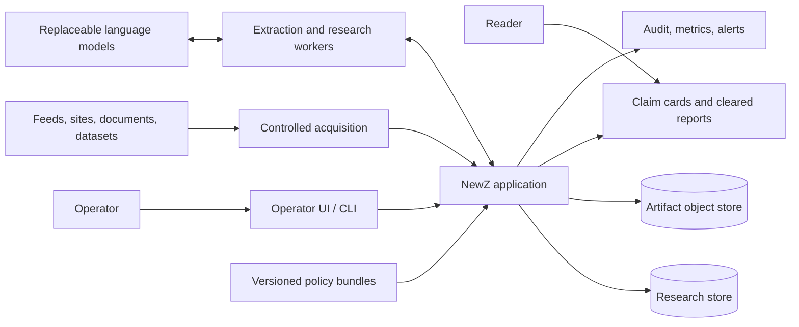
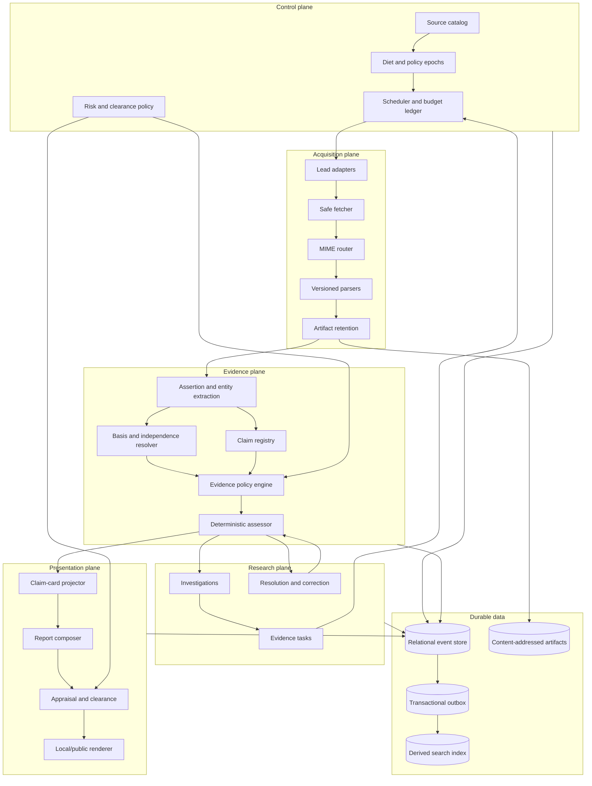
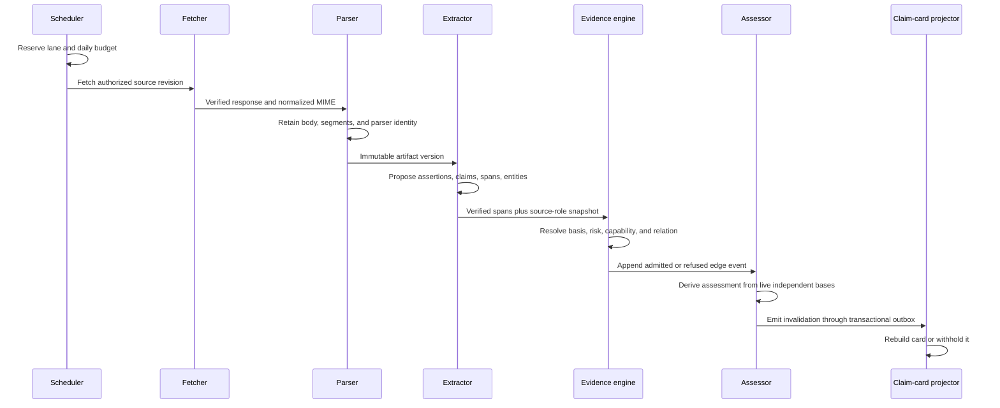
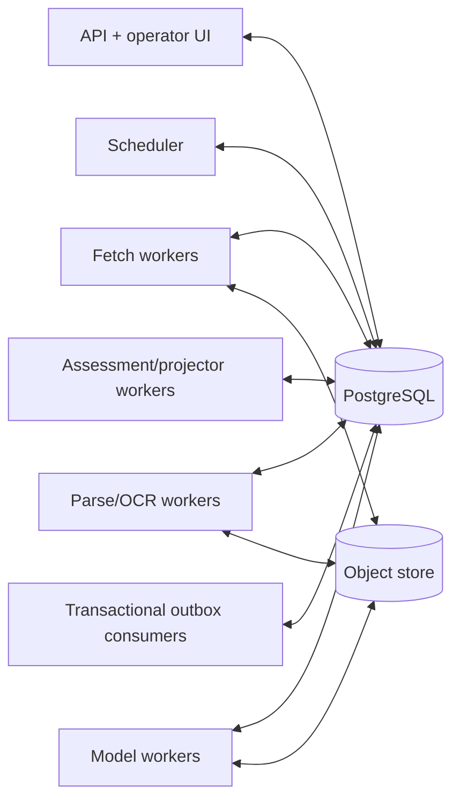

# ARCHITECTURE

**Status:** Authoritative target architecture
**Effective:** 2026-09-03

NewZ is a modular monolith with asynchronous workers and an append-oriented
research store. One evidence model serves every interface. Acquisition is
untrusted; publication is deny-by-default.

## System context



The model is a replaceable tool outside the trust boundary. It proposes
structure; deterministic policy and persisted evidence decide capability and
state.

## Component architecture



## Evidence flow



No arrow skips from a lead, snippet, model response, or artifact directly to an
assessment.

## Component responsibilities

| Component | Owns | Must not own |
|---|---|---|
| Source catalog | Stable source identity, publisher, independence group, delivery metadata, role and risk floor | Global truth or reliability score |
| Diet manager | Immutable enabled-source and policy epochs | Conclusions or evidence weight |
| Scheduler | Discovery/verification/correction lanes, reservations, retry and quarantine | Evidence admission |
| Safe fetcher | Network policy, redirects, limits, response identity | Parsing or claim extraction |
| Parser registry | MIME-to-parser dispatch, normalized bodies and segments | Semantic conclusions |
| Artifact store | Immutable body bytes/text and content hashes | Mutable assessment state |
| Extractor | Candidate spans, assertions, entities, claims | Capability grants or risk reduction |
| Basis resolver | Publication lineage and upstream-origin identity | Counting unknown origins as independent |
| Evidence engine | Deny-by-default role/scope/risk/relation policy | Narrative generation |
| Assessor | Deterministic assessment transitions | Searching or fetching |
| Research manager | Investigations, missing lanes, tasks, resolution attempts | Rewriting evidence history |
| Projector | Claim cards and dependency maps | New factual assertions |
| Appraisal/clearance | Exact-revision output permission | Altering internal evidence state |

## Storage architecture

The first implementation SHOULD use PostgreSQL for structured state and an
S3-compatible, content-addressed object store for retained artifacts. SQLite
MAY be used for isolated development fixtures but is not the production
coordination mechanism.

```text
PostgreSQL
├── catalog         sources, revisions, publishers, independence
├── control         diet epochs, policy bundles, budgets, operations
├── acquisition     attempts, responses, sightings, parse executions
├── evidence        spans, assertions, claims, bases, edges, assessments
├── research        investigations, tasks, resolution attempts
├── presentation    card revisions, appraisals, clearances, dependencies
└── operations      audit events, outbox, metrics, alerts

Object store
├── raw/sha256/...          original retained response when permitted
├── normalized/sha256/...   canonical parsed representation
└── exports/...             signed portable snapshots

Derived and disposable
├── full-text/vector search indexes
├── rendered local/public surfaces
└── metrics aggregates and caches
```

The database stores hashes, locators, retention rules, and object references.
The object store never grants evidence capability. Search indexes and rendered
surfaces are rebuilt from authoritative records.

## Runtime topology

The greenfield release uses one deployable application plus independently
scalable workers:



Workers claim operations through database leases. Durable queues are modeled
as operations plus a transactional outbox so an evidence change and its
downstream invalidation commit together. Additional infrastructure MAY replace
outbox polling later without changing the domain contract.

## Trust boundaries

1. **External-content boundary:** URLs, headers, files, markup, metadata, and
   document text are hostile. Fetch and parse workers use network and resource
   isolation.
2. **Model boundary:** prompts include only the minimum artifact segments. Model
   output is schema-validated proposal data and is never executable policy.
3. **Evidence boundary:** only verified spans and admitted edge events can affect
   an assessment.
4. **Publication boundary:** internal assessment does not imply clearance. The
   exact rendered revision and dependency set require independent appraisal.
5. **Operator boundary:** operator actions can correct metadata and authorize
   reach, but cannot silently edit the evidence ledger.

## Architectural invariants

- One acquisition spine serves feeds, directed research, documents, and
  resolvers.
- One claim/evidence graph serves every consumer.
- Current state is derived from append-only events.
- Every consequential row records policy and implementation versions.
- Duplicate publication is distinct from independent basis.
- A failed or retracted edge invalidates all dependent projections.
- Search, embeddings, prose, and prior NewZ output are never external evidence.
- Risk is monotonic within an automated operation; lowering it requires a
  reasoned operator action.
- Public reach defaults to off and can be locked down without changing evidence.
- Core records and artifacts are portable and recoverable without a model
  provider.

## Deployment modes

| Mode | Acquisition | Assessment | Presentation |
|---|---|---|---|
| Fixture | Offline fixtures only | Enabled | Local test output |
| Shadow | Live acquisition | Compared but not authoritative | Withheld |
| Pilot | Reviewed 20-source catalog and hard budgets | Authoritative internally | Local/operator only |
| Production | Approved catalog and budget expansion | Authoritative | Cleared R0–R2 output; R3 exact-review only |
| Lockdown | Paused | Historical inspection only | Public output disabled |

Transitions are explicit, audited, and reversible. Release sequencing is in
`PLAN.md`.
